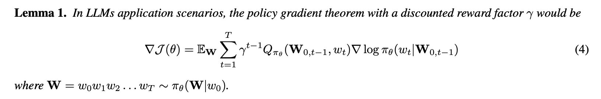
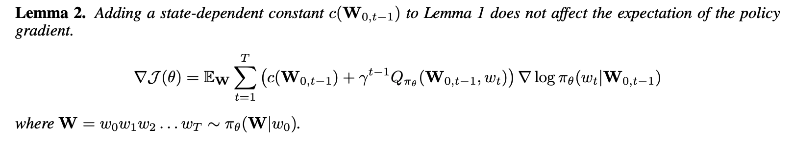
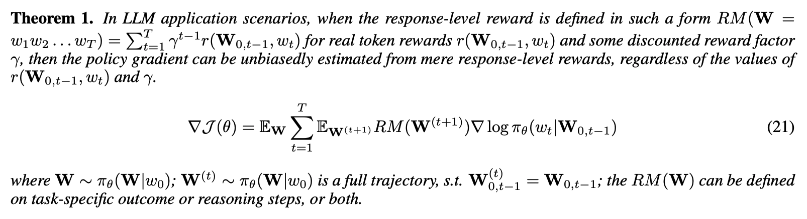
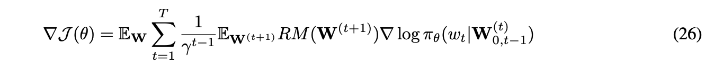
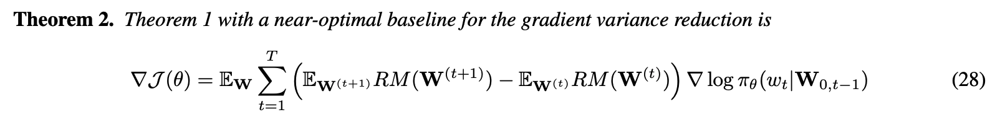
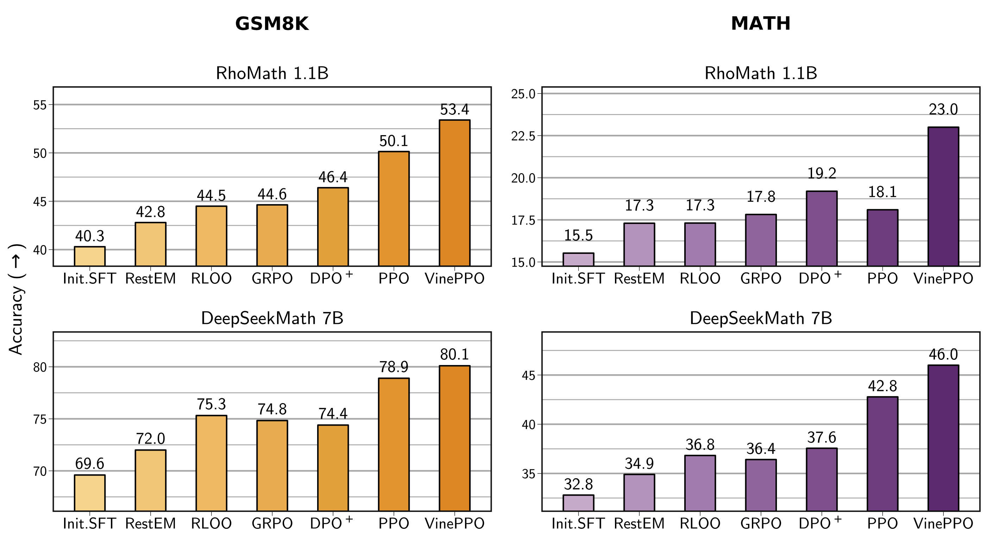

# 响应级奖励等效词级奖励 - 在线增强学习中的数学原理

$\newcommand{\TrajectoryTheorem}{\textit{Trajectory Policy Gradient Theorem~}}$
$\newcommand{\ZeroAssumption}{\textit{Zero-Reward Assumption }}$
$% \newcommand{\deltaw}{\mathbf{W}}$
$\newcommand{\E}{\mathbb{E}}$
$\newcommand{\sixcdot}{\cdot\cdot\cdot\cdot\cdot\cdot}$
$\newcommand{\threecdot}{\cdot\cdot\cdot}$
$\newcommand{\Exp}{\mathbb{E}}$
$\newcommand{\Var}{\mathbf{Var}}$
$\newcommand{\Cov}{\mathbf{Cov}}$
$\newcommand{\deltaw}{\Delta \mathbf{W}}$
$\newcommand{\Path}{\mathbf{W}}$
$\newcommand{\Patht}{\mathbf{W}^{(t)}}$
$\newcommand{\Pathk}{\mathbf{W}^{(k)}}$
$\newcommand{\PathtPlusOne}{\mathbf{W}^{(t+1)}}$
$\newcommand{\PathT}{\mathbf{W}^T}$
$\newcommand{\PolicyProb}{\pi_{\theta}}$
$\newcommand{\PolicyProbt}{\pi(w_t|\Path_{0,t-1})}$
$\newcommand{\Prompt}{w_0}$
$\newcommand{\VFunc}{V_{\PolicyProb}}$
$\newcommand{\QFunc}{Q_{\PolicyProb}}$
$\newcommand{\GFunc}[1]{G(#1)}$
$\newcommand{\RM}{RM}$
$\newcommand{\Eqn}[1]{Eqn. (#1)}$
$\newcommand{\todo}[1]{({\color{red} TODO: #1})}$

## 总结

这个工作从基本公式推导出发，主要回答几个在线增强学习中的典型现象和问题，**中间token零奖励假设**究竟对训练算法有什么样的影响？基于这个假设的算法和使用精确的*词级奖励*的算法有什么本质区别？如火如荼的GRPO、RLOO、ReMax等REINFORCE风格的算法和PPO算法在**理论建模能力**上有什么区别？奖励衰减$\gamma$有什么影响？

增强学习中的公式看起来比较复杂，但在LLM应用场景中，有一些较为特殊的地方使得给RL做一些相对精确的分析更加容易了。

## **中间token零奖励假设**

这在一些典型的场景中非常常见，比如问答场景，奖励模型通常只对一个完整的回答进行整体质量的打分；
数学推理场景，奖励模型可以简化为一条规则，最终结果是否正确。
对中间过程人工标注和训练词级奖励模型，是一个非常消耗人力、甚至难以保证准确的过程。
因此实践当中，人们往往假设，中间生成的词语不产生直接奖励，只有最后一个词语产生整个完整句子的奖励分数，这就是**中间token零奖励假设**。

这个假设看上去不合理。对于人类来说，不看最后一个词语也能几乎精准地理解整句话的含义。
虽然人类也无法定量地说清楚每个词语究竟贡献了多少信息量，但它们的贡献就的的确确、安安静静地在那里，只是我们很难计算。

过去两年中几个典型的工作也先后提到了这个假设的不合理之处，
比如ReMax指出RLHF任务训练类似**单阶段**训练而非**多阶段**[1]，
GRPO指出因为中间奖励为0而值函数需要在**每一个位置精确计算**而因此复杂而不必要[2]，
而RLOO则认为人类只关心整体奖励而中间真实的奖励不存在[7]。
因此这些工作认为PPO中的值函数网络是没必要存在的。

自然而然的，人们会问这么一个问题，如果这个响应级奖励可以被分解到每个问题，那么基于**中间token零奖励假设**的RL训练和基于token奖励精确训练的系统究竟差多少？

这种思路的代表是ABC模型[8]，采用奖励模型中最后一层的注意力机制将整体奖励进行分解，结果真的得到了提高。
他们的实验是基于非逻辑推理题目，响应级奖励模型返回一个实数。
那如果对于逻辑推理的题目、响应级奖励只返回0和1的情况呢？

咱们的工作从理论上推导下它们究竟差多少。

## 基本原理

几乎所有的LLM RL工作都是从经典的Policy Gradient Theorem开始的，这个公式是通用的推导，且基于一个潜在的假设，奖励折扣因子$\gamma=1$，否则得到的结果是一个较为复杂的形式，而非大家看到的简洁的样子。

但LLM中有个特别之处，RL中的State定义在LLM RL中其实对应到生成的token序列。
本文用$\Path$表示一个完整的路径，用$\Prompt$表示prompt，用$\Path_{i,j}$表示一段子串。
这样任意两个状态，要么不可达，要么只有一条路径可达。
我们就可以精确地将这个折扣因子引入到公式中，得到一个等价的形式。

这个形式和经典的Gradient Policy Theorem [9]相比有两个不同：第一个，后者中梯度是$\propto$于右边，而在LLM RL中是$=$右边，这样我们可以精确地分析$\gamma$应该如何取值得到最优。
第二个：后者中抽样的概率分布不同于实际需要优化的策略梯度$\PolicyProb$，这是一个经典的很难解决的bias[10]，而LLM RL中两者相等，这就方便太多了。

回忆下$\QFunc$也是表示一个未来收益的期望，和Lemma 1中最左边的$\Exp_{\Path}$是两个单独计算的期望，但都符合同一个分布。
所以实际当中，直接用当前抽样得到的$\Path$来近似$\QFunc$好了，重新定义为$G_t$函数，表示当前位置到路径结束的实际奖励。
虽然实际中只使用一个样本来估计这个$\QFunc$，方差有点大，但这是无偏估计。
于是，其论文描述基于**中间token零奖励假设**，每个位置的$G_t$就恒等于整个句子的奖励$\RM(\Path)$，也就得到了大家熟悉的GRPO、ReMax、RLOO中的核心公式了。

$$\nabla\mathcal{J}(\theta)  =\Exp_{\Path}\sum_{t=1}^{T}\gamma^{t-1}\RM(\Path)\nabla\log\pi_{\theta}(w_{t}|\Path_{0,t-1})$$

下一个重要的定理最初是用来减少策略梯度的方差，我们除此之外用来证明最核心的结论。

这个结论表明增加一个依赖状态$\Path_{0,t-1}$的常量$c$并不会改变策略梯度的值。
所以大家一般设置$c$为状态负的$\Path_{0,t-1}$的值函数$\VFunc(\Path_{0,t-1})$，并且可以证明这是**较优**解。

但咱们换种思路，设置$c(\Path_{0,t-1}) = \sum_{k=1}^{t-1}\gamma^{k-1}r(w_{k})$，这里只有$\gamma$是变量，剩下的每个位置的$r(w_k)$是客观存在但不容易精确计算的。
于是咱们自然地就得到了一个这样的结果

其中$\Path^{(t+1)}$表示一条完整的随机路径，只要它的前$t$的词语和当前路径$\Path$的前$t$的词语相同就行。

这个公式里说明了两个问题，
第一个是精确的策略梯度里并不需要计算每个中间位置的直接奖励，只需要完整路径的奖励即可。
这个很类似统计里面的**充分统计量**概念。
同样的道理，因为当前随机产生的$\Path$也是$\Path^{(t+1)}$，所以上面式子可以使用当前$\Path$来近似，然后又得到了GRPO、ReMax、RLOO中的公式了。
这说明对于REINFORCE风格的算法，基于**中间token零奖励假设**得到的策略梯度等效于基于真实而未知的词级奖励得到的策略梯度，两者等效。

第二个是策略梯度里并不出现奖励折扣因子$\gamma$，在证明过程中刚好抵消掉了。
回忆下大家使用**中间token零奖励假设**时，最后一个token的奖励并没有出现折扣，隐含着$\gamma=1$。
那如果使用这种设置，但设置$\gamma$不为1，结果会如何呢？
很有意思，我们容易得到这个结果

问题就出现了，当我们折扣未来的奖励而设置$\gamma<1$时，结果后面的位置得到了更大的权重$(\frac{1}{\gamma})^{t-1}$，产生了矛盾，所以策略梯度和折扣因子无关。而基于**中间token零奖励假设**, 那么应该设置折扣因子$\gamma=1$。

咱们继续仿效PPO也计算一个用于减少策略梯度方差的baseline值，不难得到一个**近似解**如下：

这个式子比较工整，表示的意义也很容易理解，如果当前时间t和状态下选择了$w_t$，那么基于新的状态$\Path_{0,t}$扩展任意的完整路径的期望值，相比于当前状态下$\Path_{0,t-1}$扩展的完整路径的期望值，能有多少收益。
其实baseline具有最优封闭解，但实际中计算非常不方便，因此RL中一般用一个易于计算的近似解，这也是RL常使用的技巧。

定理二是基于普适性的词级奖励推导出的带方差削减的策略梯度，长得似乎有点脸熟吧。
是的，如果基于**中间token零奖励假设**，上面式子很容易变成了更眼熟的PPO公式了。
$$\nabla\mathcal{J}(\theta)  =\Exp_{\Path}\sum_{t=1}^{T} \left(\QFunc(\Path_{0,t-1},w_{t}) - \VFunc(\Path_{0,t-1})\right) \nabla\log\pi_{\theta}(w_{t}|\Path_{0,t-1}) $$

于是，咱们可以说，**PPO是通用的具有词级奖励建模能力的模型，或者准确来说具有词级奖励的RL和其相应的响应级奖励的RL对应到相同的梯度更新公式的**，大家一开始直觉上觉得有疑虑的**中间token零奖励假设**，其实完全没有问题！

上面提到的**REINFORCE风格其实也是具有通用的词级奖励建模的模型**，原来大家辛苦寻找的词级奖励建模模型就已经隐藏在大家日常使用的模型中，只是略带怀疑的目光。

那么这些模型本身的建模能力究竟还有没有区别呢？有的。

## 与GRPO、ReMax、RLOO、DPO对比
定理二中看得较为清楚，主要有两点区别，导致收敛速度和模型能力可能有明显区别。

第一点，每个时间点下权重的第一项是一个期望，表示当前动作的权重。
PPO的公式也是估计这个期望，尽管有误差，但相比于GRPO、ReMax、RLOO仅仅使用一条蒙特卡洛样本估计，误差肯定要更小，使得收敛速度更快、目标优化更准确，直接可能导致实际当中更强的性能上限。

第二点，GRPO、ReMax、RLOO使用的减少策略梯度方差的baseline，虽然细节上有区别，但从定义上看其实等同于定理二中$\Exp_{\Path^{(t=1)}}\RM(\Path^{(t=1)})$。换句话说，每个时间t应该是其对应的baseline，但这些模型统一使用全局的$t=1$的baseline。
尽管这些模型使用了梯度标准化，即将变换为均值为0、标准差为1的标准正态分布，$z=\frac{X-\mu}{\sigma}$。
但分子上的处理不影响方差，分母上的处理确实减少了方差，但这个不是一个统计意义上谈论的方差减少方式，更像是整体上等比例地压缩了每个位置信号的振幅，一定程度上等同于使用更小的learning rate。

Perplexity公司在数学推理上研究GRPO的实践经验[5]中发现了一种现象，如果当前batch当中所有的reward都是0，根据其更新公式，每个时间t上参数更新的权重也为0。
但如果考虑PPO这种方式，很可能当前batch中一些路径仅仅是最后的步骤导致整体错误，但中间其他的步骤下计算公式2中的两项的差不等于0，这样每个位置还是可以收到有效的梯度更新。

再提到DPO，这种方法比较巧妙。先不考虑原生的DPO是个离线RL算法，效果要差于在线的RL算法，只考虑目标公式的建模能力，DPO使用的原始公式，其实是等效GRPO、ReMax、RLOO的，这就注定了其理论建模能力属于同一级别。再考虑到其离线算法的特点，综合来考虑，DPO在广泛的任务上的能力应该要差于PPO。相关实验见[6].

根据上面的分析，基本结论是在普遍任务上PPO的建模能力不差于流行的GRPO、ReMax、RLOO、DPO，如果其critic网络可以有效训练的话。

## 在数学推理上的结果

基于定理2，本文提出了TRePO算法，用基于蒙特卡洛采样的方式计算每个时间步骤中的两项。
但实际抽样本身是一个耗时的过程，因此并不会计算每一个时间t，而是作为一个外部的参数，随机产生若干个t做精确计算其advantage值。
然后对于两个精确计算t之间的时间，采用插值法得到近似结果即可。

但本文重点是前面的理论分析部分，因此我们仅仅是提出这个算法，并未在实验上做普遍验证。但很巧的是，同一阶段另一篇工作ICML 2025的工作VinePPO[3] 从**中间token零奖励假设**出发，主要目标是减低PPO中critic网络不稳定的问题，而提出了相同的基于抽样的算法。

TRePO和VinePPO都是基于蒙特卡洛采样的，带来了额外的工程复杂度。
但从模型复杂度角度说，它们简化了整体训练的难度，毕竟同时训练policy网络和critic网络的难度要明显高于训练好一个policy网络，而蒙特卡洛采用变成了一个工程问题，建模复杂度显著降低。
同时工程上说，采样算法是一个天然并行的过程，可以无上限地加速和优化。
当然这是大公司的优势，对于小公司和学校来说，这种工程也并不友好。

下面引自VinePPO在数学推理上做了多种模型的实验，得到了一些有趣的结果，也验证了一些本文分析的结论，比如PPO建模能力不差于其他流行的GRPO等算法。

## 对咱们的启发

本文主要分析了**中间token零奖励假设**对RL训练的理论影响，消除了大家对这个假设的担心。
因此在实际应用当中，大家可以大胆地使用这个假设处理一些不可分解的响应级奖励，如任务相关的，3H型特征（有用性、诚实性、无害性）等等。
而词级奖励，作为响应级奖励的一种特殊情况，也可以用这个假设来处理，工程上或许精确计算每个位置的Q函数误差更少, 但两者理论上等效。
多个响应级奖励和词级奖励混用时，还可以干脆都采用这个零假设，统一作为最后一个词语的奖励即可。

我们对比了几种主流RL算法本质上建模能力的区别，大体规约为两种，REINFORCE中以GRPO为代表，效果好，节省内存；actor-critic框架中以PPO为代表，效果更上一层楼，但代价也更大。
在各自的类别里应该也会有更有技巧性的新算法，但如果不往系统中额外注入信息量的前提下（比如使用更强的奖励模型），或许差距不会很大。

在实际应用当中，决定一个RL系统效果的，还包括用什么样的数据、使用什么样的奖励模型（比如是否考虑更细腻的特征，如奖励或者惩罚一些特定的推理步骤等）,也是非常重要的因素，甚至更有决定性。
如果将这两类代表性RL算法包装成一个黑箱子，模型训练者就不需要了解复杂的RL算法细节，而大大降低了使用门槛。
同时针对具体的问题，将更多精力放在寻找更强大的奖励模型上，整个过程或许更简单、高效地提高整体系统的性能，从而快速地验证新的应用场景和方向。

## 引用
[1] Ziniu Li, Tian Xu, Yushun Zhang, Zhihang Lin, Yang Yu, Ruoyu Sun, and Zhi-Quan Luo. Remax: A simple, effective, and efficient reinforcement learning method for aligning large language models. arXiv preprint arXiv:2310.10505, 2023.

[2] Zhihong Shao, Peiyi Wang, Qihao Zhu, Runxin Xu, Junxiao Song, Xiao Bi, Haowei Zhang, Mingchuan Zhang,
YK Li, Y Wu, et al. Deepseekmath: Pushing the limits of mathematical reasoning in open language models. arXiv preprint arXiv:2402.03300, 2024.

[3] Amirhossein Kazemnejad, Milad Aghajohari, Eva Portelance, Alessandro Sordoni, Siva Reddy, Aaron Courville, and Nicolas Le Roux. Vineppo: Unlocking rl potential for llm reasoning through refined credit assignment. arXiv preprint arXiv:2410.01679, 2024.

[4] AI Team. RL Training For Math Reasoning Introduction and Motivation. https://www.perplexity.ai/hub/blog/rl-training-for-math-reasoning. 2025.

[5] John Schulman, Filip Wolski, Prafulla Dhariwal, Alec Radford, and Oleg Klimov. Proximal policy optimization algorithms. arXiv preprint arXiv:1707.06347, 2017.

[6]  Shusheng Xu, Wei Fu, Jiaxuan Gao, Wenjie Ye, Weilin Liu, Zhiyu Mei, Guangju Wang, Chao Yu, and Yi Wu. Is dpo superior to ppo for llm alignment? a comprehensive study. arXiv preprint arXiv:2404.10719, 2024.

[7] Arash Ahmadian, Chris Cremer, Matthias Galle, Marzieh Fadaee, Julia Kreutzer, Olivier Pietquin, Ahmet ´ Ust ¨ un, ¨ and Sara Hooker. Back to basics: Revisiting reinforce style optimization for learning from human feedback in llms. arXiv preprint arXiv:2402.14740, 2024.

[8] Alex J Chan, Hao Sun, Samuel Holt, and Mihaela Van Der Schaar. Dense reward for free in reinforcement learning from human feedback. arXiv preprint arXiv:2402.00782, 2024.

[9] Richard S Sutton and Andrew G Barto. Reinforcement learning: An introduction. second, 2018.

[10] Weizhen Wang, Jianping He, and Xiaoming Duan. Analysis of on-policy policy gradient methods under the distribution mismatch. arXiv preprint arXiv:2503.22244, 2025.
